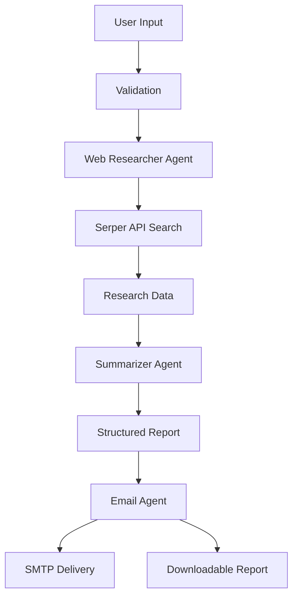

# Prime Brief

<div align="center">

[](https://www.python.org/)
[](https://streamlit.io/)
[](https://www.crewai.com/)
[](https://gemini.google.com/)

**Intelligence, Refined. Decisions, Defined.**

*Prime Brief leverages autonomous AI agents to distill complex web research into clear, actionable executive summaries directly in your inbox.*


[Features](#features) • [Quick Start](#quick-start) • [Architecture](#architecture) • [Configuration](#configuration) • [Usage](#usage)

## Preview


</div>

---

## Features

<table>
<tr>
<td width="50%">

### Multi-Agent Architecture
- **Web Researcher**: Expert at finding and verifying sources
- **Content Summarizer**: Transforms data into actionable insights
- **Email Coordinator**: Delivers professional formatted reports

</td>
<td width="50%">

### Professional Features
- Modular, maintainable codebase
- Comprehensive error handling
- Structured logging with colors
- Input validation & sanitization

</td>
</tr>
<tr>
<td>

### Multiple Report Formats
- **Summary Report**: Quick overview with key points
- **Detailed Analysis**: In-depth research with evidence
- **Executive Brief**: One-page leadership summary

</td>
<td>

### Modern UI
- Sleek Streamlit interface
- Real-time progress tracking
- Downloadable Markdown reports
- Responsive design

</td>
</tr>
</table>

---

## Quick Start

### Prerequisites

- Python 3.10 or higher
- Google Gemini API key ([Get one here](https://makersuite.google.com/app/apikey))
- Serper API key ([Get one here](https://serper.dev/))
- Gmail account with App Password ([Setup guide](https://support.google.com/accounts/answer/185833))

### Installation

```bash
# Clone the repository
git clone https://github.com/ahmedtarek-mel/prime-brief.git
cd prime-brief

# Create virtual environment
python -m venv venv
source venv/bin/activate  # On Windows: venv\Scripts\activate

# Install dependencies
pip install -r requirements.txt

# Configure environment
cp .env.example .env
# Edit .env with your API keys
```

### Run the Application

```bash
streamlit run app/main.py
```

Open your browser to `http://localhost:8501`

---

## Architecture

```
prime-brief/
├── app/
│   ├── main.py              # Streamlit entry point
│   ├── config/
│   │   └── settings.py      # Pydantic configuration
│   ├── agents/
│   │   ├── base_agent.py    # Agent factory
│   │   ├── researcher.py    # Web Researcher agent
│   │   ├── summarizer.py    # Content Summarizer agent
│   │   └── email_agent.py   # Email Coordinator agent
│   ├── tools/
│   │   ├── search_tool.py   # Serper API integration
│   │   └── email_tool.py    # SMTP email tool
│   ├── tasks/
│   │   └── research_tasks.py # Task definitions
│   ├── services/
│   │   └── crew_service.py  # CrewAI orchestration
│   ├── ui/
│   │   ├── components.py    # Streamlit components
│   │   └── styles.py        # CSS styling
│   └── utils/
│       ├── logger.py        # Logging utilities
│       └── validators.py    # Input validation
├── requirements.txt
├── pyproject.toml
└── README.md
```

### System Flow



---

## Configuration

Create a `.env` file in the project root:

```env
# LLM Configuration
GOOGLE_API_KEY=your_google_api_key
LLM_PROVIDER=gemini
GEMINI_MODEL=gemini/gemini-flash-lite-latest
LLM_TEMPERATURE=0.7
MAX_RPM=4

# Search Configuration
SERPER_API_KEY=your_serper_api_key

# Email Configuration
EMAIL_USER=your_email@gmail.com
EMAIL_PASS=your_app_password
SMTP_SERVER=smtp.gmail.com
SMTP_PORT=587

# Application Settings
LOG_LEVEL=INFO
ENABLE_MEMORY=true
ENABLE_VERBOSE=true
```

> **Note**: For Gmail, you must use an [App Password](https://support.google.com/accounts/answer/185833), not your regular password.

---

## System Limits & Quotas

This system relies on several external APIs, each with its own usage limits (especially on free tiers):

### Gemini API (Flash Lite / Free Tier)
- **Requests Per Minute (RPM)**: 15 RPM (Configured to 4 RPM for stability)
- **Requests Per Day (RPD)**: ~1,500 RPD
- **Result**: Complex research tasks may take a few minutes to complete due to rate limiting.

### Gmail SMTP
- **Sending Limit**: ~500 emails per day for standard Gmail accounts.
- **Bursts**: Rapid sending may trigger temporary blocks.

### Serper API (Free Plan)
- **Total Queries**: 2,500 free queries (one-time) or specifically allocated monthly quota.
- **Per Research**: Each research task uses approx. 3-5 search queries.

> **Tip**: If you encounter 429 or 503 errors, wait a few minutes and try again. The system is designed to handle transient errors automatically.

---

## Usage

1. **Enter Research Topic**: Be specific for better results
   - ❌ "AI developments"
   - ✅ "Latest AI developments in healthcare diagnostics 2025"

2. **Configure Report Settings**:
   - Number of sources (3-10)
   - Report format (Summary, Detailed, Executive)

3. **Provide Email Address**: Where to send the report

4. **Launch Research**: Click the button and watch the AI work!

5. **Download Reports**: Get Markdown files for your records

---

## Development

### Running Tests

```bash
# Install dev dependencies
pip install -e ".[dev]"

# Run tests
pytest tests/ -v

# With coverage
pytest tests/ --cov=app --cov-report=html
```

### Code Formatting

```bash
# Format code
black app/

# Lint code
ruff check app/
```

---

## Report Formats

| Format | Best For | Length |
|--------|----------|--------|
| **Summary Report** | Quick updates, team meetings | 1-2 pages |
| **Detailed Analysis** | Research projects, documentation | 3-5 pages |
| **Executive Brief** | Leadership updates, decisions | 1 page max |

---

## Contributing

Contributions are welcome! Please feel free to submit a Pull Request.

1. Fork the repository
2. Create your feature branch (`git checkout -b feature/AmazingFeature`)
3. Commit your changes (`git commit -m 'Add some AmazingFeature'`)
4. Push to the branch (`git push origin feature/AmazingFeature`)
5. Open a Pull Request

---

## License

This project is licensed under the MIT License - see the [LICENSE](LICENSE) file for details.

---

## 👨‍💻 Author

**Ahmed Tarek**  
*Data Scientist & Machine Learning Engineer*


<div align="center">

[](https://www.linkedin.com/in/ahmed-tarek-mel)
[](mailto:ahmedtarekmel@gmail.com)
[](https://github.com/ahmedtarek-mel)

</div>

---

## 🙏 Acknowledgments

- [CrewAI](https://www.crewai.com/) - Multi-agent orchestration framework
- [Google Gemini](https://gemini.google.com/) - Large Language Model
- [Serper](https://serper.dev/) - Google Search API
- [Streamlit](https://streamlit.io/) - Web application framework

---

<div align="center">

**Built with ❤️ for automated research and reporting**

</div>
